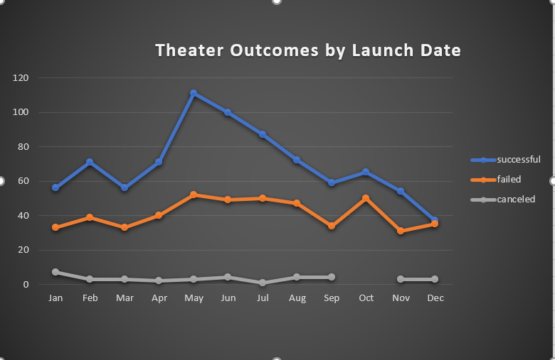
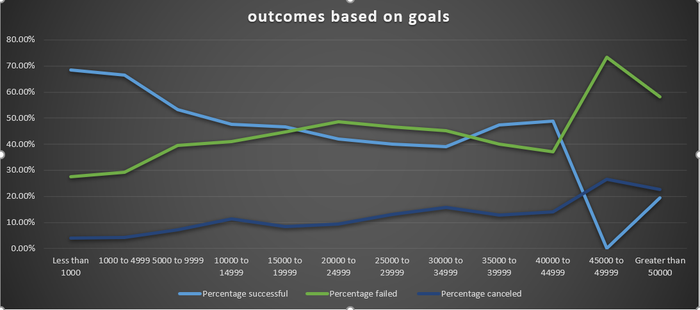

# kickstarter-analysis with Excel

**Overview of project :**

We are analyzing the given data set to help ‘Louise start a successful fundraising campaign for the play “Fever” she has a goal of $10000 USD. 

**Purpose:**

Purpose of this analysis is to find insights from the dataset based on goals and launch date to help Louise achieve the goal of raising $10000 USD and to find metrics that will help achive the gaol. 

**Analysis  and challenges:**

2 major challenges I faced is to fix excel glitches and to figure out what are the right questions to ask to help with this analysis.

**Outcomes based on launch date:**

1.Fund raising campaigns for parent category “theaters” did well when it’s launched during the month of may from the years 2009 to 2017. Out of total theater based fundraising campaigns in the data given 1369 , there were 839 successful campaigns , 61% of campaigns became successful in the category theaters and Its important to note that out of these 839 , 166 successful events happened in the month of may (2009 to 2017), that shows 13.2% of all successful events came from the month of May. June and July were relatively successful with percentage of 11.9% and 10.4%

2.The campaigns that started in the month of dec has the lowest success rate of 8.9% (75/839), out of all campaigns launched during 2009 to 2017 it’s safe to say that to be a successfully reach the goal of raising $10000 we need launch the campaign in may not in dec , 36% (493/1369) failed to reach the goal.

**Outcomes based on Goals:**

1.There is correlation between higher fund raising goals and lower success rate, Goals above $45000 to 49999 has a success rate of 0% and goals greater than 50000 has the success rate of 19.37%, we have a goal of 10000 USD , in the range of $10000 to 14999 , the success rate is 47.73%.

2.Top 3 success rates are for goals between 1000 to 10000 USD , 68.44%,66.61%, & 53.21%, Its safe conclusion to say we have a better chance of being a successful campaign if we lower our fund raising goal of $10000, to fit into the range of 5000 to 9999 USD.

**Limitations of this dataset:**

1.We know the success rate for theaters are high in the month of may ,June and July during 2009 to 2017 , We do not have the specific data that says what contributes to this success rate for example: summer vacations and /or higher number of tourists during the time of may June july.

2.We need further information and analysis to prove that may June July are our best option for launching this fund raiser. 

3.Even though this dataset shows out of 64196 people, 58457 contributed to successful campaigns for theater category, we can not say what number of people will actually contribute to the play “fever” based on these number this is out of our control.

4.We also do not know how this data is collected and whether we have missed any age group or demography ,elements that can be helpful.

5.Where Louise is planning to conduct the play and what is the age group of people in that particular location or area who actually spent money to go watch a play in theaters     is a good contributor that will give us more precise information and understanding to plan our campaign.

**Other possible tables and/or graphs :**

1.Outcomes based on backers count ,Image and anlysis in excel file attached 

2.Outcomes based on average duration of campaign for category theater,Image and anlysis in excel file attached 

**Links** [kickstarter challenge] (https://github.com/reachme1212/kickstarter-analysis/blob/main/kickstarter_challenge.xlsx)

**Results:**

1.It’s safe to say that to  successfully reach the goal of raising $10000 we need launch the campaign in the month of may second best june or july not in dec.

2.We have a better chance of being a successful campaign if we lower our fund raising goal of $10000, to fit into the range of 5000 to 9999 USD.

