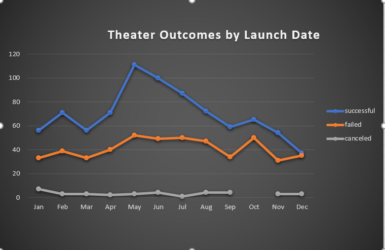
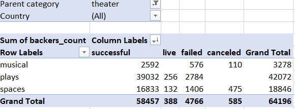
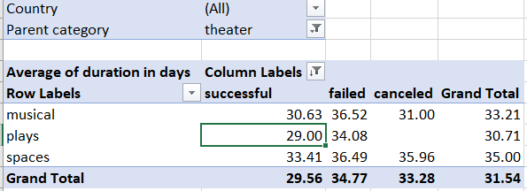
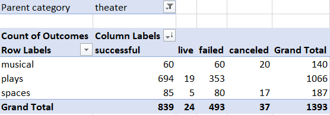
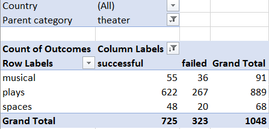
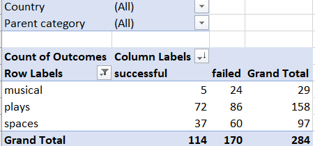
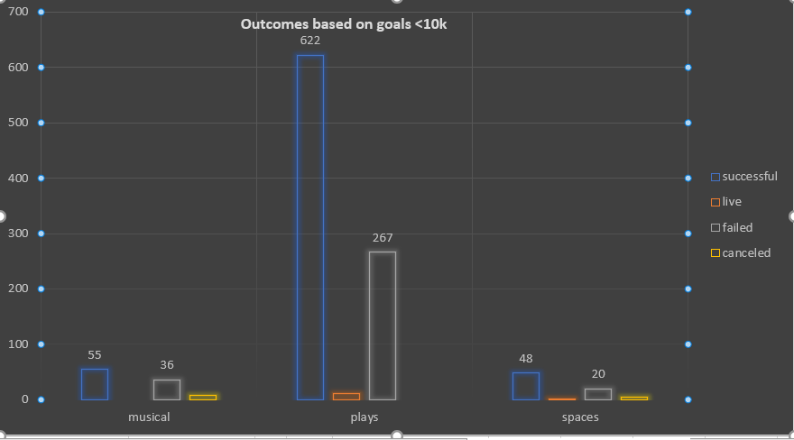
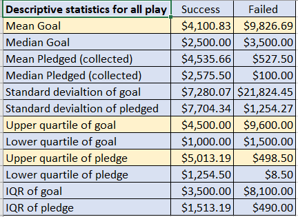

# kickstarter-analysis with Excel

**Overview of project :**

We are analyzing the given data set to help Louise start a successful fundraising campaign for the play “Fever” she has a goal of $10000 USD.

**Purpose:**

Purpose of this analysis is to find insights from the dataset based on goals and launch date to help Louise achieve the goal of raising $10000 USD and to find metrics that will help achieve the goal.

**Analysis  and challenges:**

Major challenges I faced is to fix excel glitches for pivots , Vlookups and git bash pull and push, It was a challenge to figure out what are the right questions to ask that helps with this analysis. 

**Outcomes based on launch date:**

1.Fund raising campaigns for parent category “theaters” did well when it’s launched during the month of May from the year 2009 to 2017. Out of total theater based fundraising campaigns in the data given 1369, there were 839 successful campaigns, 61% of campaigns became successful in the category theaters and it’s important to note that out of these 839, 111 successful events happened in the month of May (2009 to 2017), that shows 13.2% of all successful events came from the month of May. June and July were relatively successful with percentage of 11.9% and 10.4%, From the data given its easy to see May is a good month to launch.

2.The campaigns that started in the month of dec has the lowest success rate, total event for the month of dec is 75 out of which 37 succeeded , 35 failed and 3 cancelled, month of december contibuted 4.41% to overall successful events , Its safe to say we need to launch the campaign in may not in dec.

**Outcomes based on Goals:**

1.From the table below its easy to see the fund raising events that had a goal of under 10000 USD have better success rates, because the goals between 5000 to 9999 has a success rate of 53.21% Lousie should think of reducing the goal to fit this range.

2.Top 3 success rates are for goals between 1000 to 10000 USD, and goals over 10000 to 14999 USD at 47.73% all other goals have lower success rate. Its safe conclusion to say we have a better chance of being a successful campaign if we lower our fund-raising goal of $10000, to fit into the range of 5000 to 9999 USD or 1000 to 4999 whaterever is feasible.

**Limitations of this dataset:**

1.We know the success rate for theaters are high in the month of May, June and July during 2009 to 2017, We do not have the specific data that says what contributes to this success rate for example: summer vacations and /or higher number of tourists during the time of May June July.

2.For the category theaters this dataset shows out of 64196 people, 58457 contributed to all successful campaigns (91%), we cannot predict what number of people will actually contribute to the play “fever” based on these numbers as this is out of our control.

4.We also do not know how this data is collected and we have no data like age group who contributes to these fund raisers or Specific demographic information instead of a country specific data , reason being US is very large compared to GB so there may be differences for example :in some states in the US people can contribute more to sports and never for plays or less for the plays and viceversa , these are some elements that can be helpful in determining or predicting what should be done to be a successful fund raising campaign for play.

**Other possible tables and/or graphs :**

1.Outcomes based on backers count, Chart and analysis are available in excel file attached below, In the category theaters and plays: total plays 42072 , 65.5% (42072/64196) of all people contributed to parent category theater contributed to plays , people who contributed to all fund raising events are 463246 , out of which  42072 contributed to plays 9.08%. Its safe to say fund raising events for plays is popular. 

2.Outcomes based on average duration of campaign for category theater, Chart and analysis in excel file attached, Out of the total number of successful plays 1066, the average duration of plays campaign is 29 days , Its safe to say Louise’s campaign should last 29 to 33 days minimum.

**Analysis based on goals under 10k and over 10k:**

1.Total number of all events for the category goals under $10000 is 2451, 889 are plays, plays contributes to 36.27% to all events under the goal 10000 USD, plays contibute 84% to overall theater events , When goals are below $10000 the successful outcome are 622, that is 70 % (622/889) of all plays succeeded. 

2.Total number of events for category plays with goals equal to $10000 or above are 158, successful plays are 72, 45.5% success rate, 11769 people contributed for these events.

3.For all events with goals equal to and above 10000 USD the success rate is lower compare to goals under 10000 USD. 

**Descriptive statistics for all play:**

  1.Average goal amount of all successful plays shows $4100.83 , For the failed plays its $9826.69 , Average pledged amount for successful play events is $ 4535.66 higher compared to average pledeged amount of failed play $527.50, its safe to say lower goal amounts contributed to success of the fund raising campaign.
  
  2.When we look at the upper quartile amounts for the category goals of successful plays who reached their goals is $4500.00 , 75% of all plays had goals below $4500, 
    Louise's goal is $10000 which is way more than the average of all successful plays good idea is to lower the goal.
    
  3.There are total of 52 plays with exact goal of $10000 and out of which 29 were successful 55.8% successrate, this doesnt mean Louise have a 50% chance of being successful as we can not control how many will actually contribute and these are very small samples to analyse and spot any trend and cant not give any recomendations based on this.
    
  

**Links** [Excel zipped folder]( https://github.com/reachme1212/kickstarter-analysis/blob/main/Kickstarter_excel_reports.zip)

**Results:**

1.It’s safe to say that to successfully reach the goal of $10000 we need launch the campaign in the month of may, second best options are June or July, Its best not to launch our campaign during the month of dec. 

2.We recommend the campaign last at least 29 days before closing, because the average duration of successful fund raising campaigns are 29 days.

3.We have a better chance of being a successful if we lower our fund-raising goal of $10000, to fit into the range of $5000 to 9999 USD, as higher goals in this dataset has a lower success rate.

